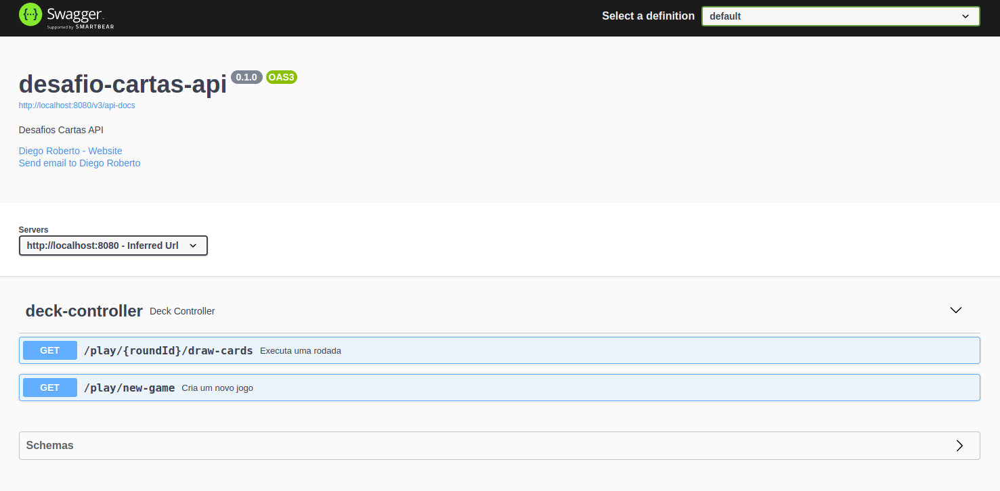
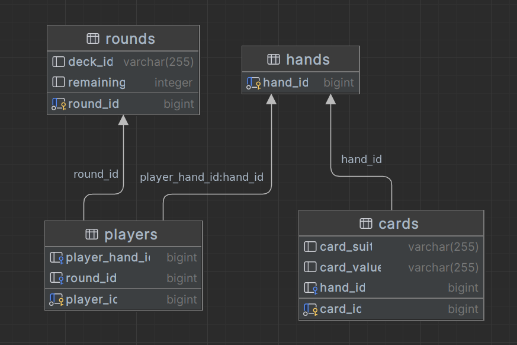
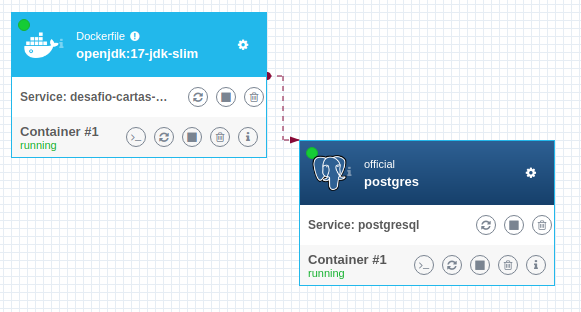

# Desafio Cartas API
<h3>

</h3>

### Tecnologias utilizadas
Java 17  
Spring-boot 2.7.11 
Swagger 3.0.0 
JUnit 5.8.2 
Mockito 3.11.2 
Lombok 1.18.26 
PostgreSQL 13 

Este projeto consiste na implementação de uma aplicação Spring Boot que utiliza a API Deck of Cards para criar um baralho e, em seguida, montar quatro mãos de cartas, cada uma com cinco cartas.
 

## Regras do Jogo
O objetivo é calcular a somatória das cartas em cada mão e determinar o vencedor. Em caso de empate, o sistema identifica e retorna os vencedores empatados.

>A = 1  
>K = 13  
>Q = 12  
>J = 11  

  

## Executando em ambiente local com Docker 🐋
A partir da pasta raiz do projeto, acesse a pasta docker-compose e execute o comando para iniciar o container:
> docker-compose up --build
>

Feito isso, verifique se os containers estão "up" e faça uma requisição na API utilizando Postman ou até mesmo o swagger-ui:
> localhost:8080/play/new-game
>

>http://localhost:8080/swagger-ui/#/play/new/game
>

O container postgresql é dependência do container da API, então irá iniciar antes do build, automaticamente.
Senão, utilize o comando abaixo antes de executar o backend novamente:

> docker-compose up -d postgresql
>

  
 

## Executando em ambiente local com Maven
### Na raiz da pasta do backend, execute:
> mvn install
>
> mvn spring-boot:run
>

#### Ou utilize a IDE de sua preferência.

  

## Executando testes unitários:
> ./mvnw test
>

Porém, recomendo que os testes sejam executados pela IDE, devido a variáveis de ambiente e versões de Java e Maven.
Cada classe de teste pode ser testada independente.

  

## Documentação da API:
> http://localhost:8080/swagger-ui.html
>

  

# Diagrama da Base de Dados

  

# Estrutura de Containers - Docker

  

